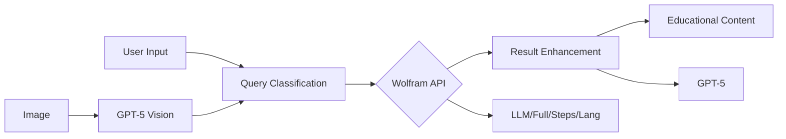

# Wolfram Math & Science Service

A comprehensive math and science problem-solving service that integrates Wolfram Alpha's computational capabilities with GPT-5 Pro's language understanding.

## Features

- **Multi-Modal Input**: Accept text queries and image uploads of math problems
- **Intelligent Routing**: Automatically selects the best Wolfram API for each query
- **Step-by-Step Solutions**: Detailed derivations with explanations
- **Educational Content**: Generated flashcards, quizzes, and practice problems
- **Visual Outputs**: Mathematical plots and diagrams
- **Enhanced Explanations**: GPT-5 powered clarifications and insights

## Architecture



## Setup

1. **Clone and install dependencies:**

```bash
cd wolfram-math-service
pip install -r requirements.txt
```

2. **Configure environment variables:**

```bash
cp env.example .env
# Edit .env with your API keys:
# - WOLFRAM_APP_ID
# - OPENAI_API_KEY
```

3. **Run the service:**

```bash
python main.py
```

The service will be available at `http://localhost:8000`

## API Endpoints

### Math Solving

#### POST `/api/v1/math/solve`

Solve mathematical problems with explanations.

**Request:**

```json
{
  "query": "integrate x^2 * sin(x) dx",
  "show_steps": true,
  "student_level": "undergraduate",
  "include_educational": true
}
```

**Response:**

```json
{
  "success": true,
  "query": "integrate x^2 * sin(x) dx",
  "result": {
    "solution": "\\frac{2x\\cos(x)}{1} - \\int \\cos(x) dx + \\int 2\\cos(x) dx",
    "final_answer": "\\frac{x^{2} \\cos x - 2 x \\sin x + 2 \\cos x + C}{1}",
    "steps": [
      "Use integration by parts: ∫u dv = uv - ∫v du",
      "Let u = x², dv = sin(x) dx",
      "Then du = 2x dx, v = -cos(x)",
      "So ∫x² sin(x) dx = -x² cos(x) - ∫-cos(x) * 2x dx = -x² cos(x) + 2∫x cos(x) dx"
    ]
  },
  "explanation": "This integral requires integration by parts twice. First integrate x² sin(x), then the resulting integral of x cos(x), and finally integrate cos(x).",
  "steps": [
    {
      "step": 1,
      "description": "Apply integration by parts with u = x², dv = sin(x) dx",
      "result": "-x² cos(x) + 2∫x cos(x) dx"
    },
    {
      "step": 2,
      "description": "Apply integration by parts again with u = x, dv = cos(x) dx",
      "result": "-x² cos(x) + 2[x sin(x) + ∫sin(x) dx]"
    }
  ],
  "educational_content": {
    "related_concepts": ["Integration by parts", "Trigonometric integrals"],
    "difficulty": "intermediate",
    "prerequisites": ["Basic integration", "Product rule for derivatives"]
  },
  "visualizations": [
    {
      "type": "plot",
      "title": "Graph of x² sin(x)",
      "data": "base64_encoded_plot_image"
    }
  ]
}
```

#### POST `/api/v1/math/solve-image`

Solve problems from uploaded images.

**Request:**

```bash
curl -X POST http://localhost:8000/api/v1/math/solve-image \
  -F "file=@problem.jpg" \
  -F "show_steps=true" \
  -F "student_level=undergraduate"
```

**Response:**

```json
{
  "success": true,
  "query": "Find the limit as x approaches 2 of (x² - 4)/(x - 2)",
  "result": {
    "solution": "Direct substitution gives 0/0, so factor numerator",
    "final_answer": "4",
    "steps": [
      "Plug in x = 2: (4 - 4)/(2 - 2) = 0/0 (indeterminate)",
      "Factor numerator: (x - 2)(x + 2)/(x - 2)",
      "Cancel (x - 2) terms: x + 2",
      "Substitute x = 2: 2 + 2 = 4"
    ]
  },
  "explanation": "This is a limit problem that simplifies to a removable discontinuity. The function is undefined at x=2, but the limit exists.",
  "steps": [
    {
      "step": 1,
      "description": "Direct substitution",
      "result": "0/0 indeterminate form"
    },
    {
      "step": 2,
      "description": "Factor and simplify",
      "result": "x + 2"
    }
  ],
  "educational_content": {
    "related_concepts": ["Limits", "Removable discontinuities", "Factoring"],
    "difficulty": "beginner",
    "prerequisites": ["Basic algebra", "Function evaluation"]
  }
}
```

#### POST `/api/v1/math/plot`

Create mathematical plots.

**Request:**

```bash
curl -X POST http://localhost:8000/api/v1/math/plot \
  -F "expression=sin(x) + cos(2*x)" \
  -F "variable=x" \
  -F "range_min=-10" \
  -F "range_max=10"
```

**Response:**

```json
{
  "success": true,
  "expression": "sin(x) + cos(2*x)",
  "plot": {
    "format": "svg",
    "data": "<svg xmlns='http://www.w3.org/2000/svg'...>...</svg>",
    "dimensions": {
      "width": 600,
      "height": 400
    },
    "range": {
      "x_min": -10,
      "x_max": 10,
      "y_min": -2.5,
      "y_max": 2.5
    }
  }
}
```

### Educational Content

#### POST `/api/v1/educational/flashcards`

Generate flashcards from problems.

**Request:**

```json
{
  "problem": "Find the derivative of x^3 + 2x",
  "solution": "3x^2 + 2",
  "concepts": ["derivatives", "power rule"],
  "count": 5
}
```

**Response:**

```json
{
  "success": true,
  "flashcards": [
    {
      "id": "card_001",
      "front": "What is the derivative of x³?",
      "back": "3x² (power rule: d/dx[xⁿ] = nxⁿ⁻¹)",
      "concept": "power rule",
      "difficulty": "beginner",
      "created_at": "2024-01-15T10:30:00Z"
    },
    {
      "id": "card_002",
      "front": "What is the derivative of a constant?",
      "back": "0 (derivative of any constant is zero)",
      "concept": "constant rule",
      "difficulty": "beginner",
      "created_at": "2024-01-15T10:30:00Z"
    },
    {
      "id": "card_003",
      "front": "Find d/dx[x³ + 2x]",
      "back": "3x² + 2 (sum rule + power rule)",
      "concept": "sum rule",
      "difficulty": "beginner",
      "created_at": "2024-01-15T10:30:00Z"
    }
  ],
  "schedule": {
    "total_cards": 5,
    "review_schedule": [
      {
        "date": "2024-01-16",
        "cards": ["card_001", "card_002"]
      },
      {
        "date": "2024-01-18",
        "cards": ["card_003"]
      }
    ],
    "next_review": "2024-01-16"
  },
  "export_formats": ["anki", "csv", "json"]
}
```

#### POST `/api/v1/educational/quiz`

Generate quizzes on topics.

**Request:**

```json
{
  "topic": "Calculus - Derivatives",
  "concepts": ["power rule", "chain rule", "product rule"],
  "question_count": 10,
  "difficulty": "intermediate"
}
```

**Response:**

```json
{
  "success": true,
  "quiz": {
    "id": "quiz_1705334400.123",
    "title": "Quiz: Calculus - Derivatives",
    "topic": "Calculus - Derivatives",
    "concepts": ["power rule", "chain rule", "product rule"],
    "difficulty": "intermediate",
    "created_at": "2024-01-15T12:00:00.123456",
    "time_limit": 30,
    "questions": [
      {
        "number": 1,
        "type": "multiple_choice",
        "question": "What is the derivative of f(x) = x³?",
        "options": ["x²", "3x²", "3x³", "x⁴"],
        "correct_answer": "3x²",
        "explanation": "Using the power rule: d/dx[xⁿ] = nxⁿ⁻¹, so d/dx[x³] = 3x²",
        "points": 5,
        "concept": "power rule"
      },
      {
        "number": 2,
        "type": "short_answer",
        "question": "Find the derivative of f(x) = (x² + 1)³ using the chain rule.",
        "answer_format": "mathematical expression",
        "correct_answer": "3(x² + 1)² * 2x",
        "explanation": "Let u = x² + 1, then f(x) = u³. Chain rule: f'(x) = 3u² * u' = 3(x² + 1)² * 2x",
        "points": 10,
        "concept": "chain rule"
      }
    ],
    "total_points": 100
  },
  "submission_endpoint": "/educational/quiz/quiz_1705334400.123/submit"
}
```

#### POST `/api/v1/educational/explain/concept`

Get detailed concept explanations.

**Request:**

```json
{
  "concept": "chain rule",
  "context": "calculus derivatives",
  "examples_count": 3
}
```

**Response:**

```json
{
  "success": true,
  "explanation": {
    "concept": "chain rule",
    "definition": "The chain rule states that the derivative of a composite function is the derivative of the outer function evaluated at the inner function, multiplied by the derivative of the inner function.",
    "formula": "If y = f(g(x)), then dy/dx = f'(g(x)) * g'(x)",
    "intuition": "Think of it as: 'the rate of change of the outside function with respect to the inside function, times the rate of change of the inside function with respect to x'",
    "examples": [
      {
        "problem": "d/dx[sin(x²)]",
        "solution": "cos(x²) * 2x",
        "explanation": "Outer function: sin(u), Inner function: u = x²"
      },
      {
        "problem": "d/dx[(x³ + 1)⁴]",
        "solution": "4(x³ + 1)³ * 3x²",
        "explanation": "Outer function: u⁴, Inner function: u = x³ + 1"
      },
      {
        "problem": "d/dx[e^(x² + 3x)]",
        "solution": "e^(x² + 3x) * (2x + 3)",
        "explanation": "Outer function: e^u, Inner function: u = x² + 3x"
      }
    ],
    "common_mistakes": [
      "Forgetting to multiply by the inner derivative",
      "Incorrectly identifying the outer and inner functions",
      "Not applying the chain rule when needed"
    ],
    "related_concepts": [
      "composite functions",
      "power rule",
      "exponential derivatives"
    ],
    "difficulty": "intermediate"
  },
  "analogy": {
    "description": "Like putting on socks and shoes: you put on the socks first (inner function), then the shoes (outer function). To find how fast you're getting dressed, you need both the speed of putting on socks and the speed of putting on shoes.",
    "applicability": "high"
  }
}
```

#### POST `/api/v1/educational/practice-session`

Generate practice sessions with mixed educational content.

**Request:**

```json
{
  "topic": "Integration by Parts",
  "duration_minutes": 30,
  "difficulty": "intermediate"
}
```

**Response:**

```json
{
  "success": true,
  "practice_session": {
    "topic": "Integration by Parts",
    "duration_minutes": 30,
    "difficulty": "intermediate",
    "components": {
      "warmup_flashcards": 5,
      "quiz_questions": 15,
      "review_flashcards": 5
    },
    "estimated_completion": "30 minutes",
    "learning_objectives": [
      "Master the integration by parts formula",
      "Identify when to apply integration by parts",
      "Choose appropriate u and dv substitutions",
      "Handle multiple applications of integration by parts"
    ],
    "session_structure": [
      {
        "phase": "warmup",
        "type": "flashcards",
        "duration": "10 minutes",
        "content": "Basic integration by parts formula and simple examples"
      },
      {
        "phase": "practice",
        "type": "quiz",
        "duration": "15 minutes",
        "content": "Mixed problems requiring integration by parts"
      },
      {
        "phase": "review",
        "type": "flashcards",
        "duration": "5 minutes",
        "content": "Review of challenging concepts and common mistakes"
      }
    ]
  }
}
```

## Query Types and Routing

The service automatically classifies queries and routes to the appropriate Wolfram API:

- **Wolfram LLM API**: Natural language queries, simple calculations
- **Show Steps API**: Problems requiring step-by-step solutions
- **Full Results API**: Queries needing structured data with multiple interpretations
- **Language Evaluation API**: Code execution, plotting, complex computations

## Examples

### 1. Calculus Problem

```bash
curl -X POST http://localhost:8000/api/v1/math/solve \
  -H "Content-Type: application/json" \
  -d '{
    "query": "Find the integral of x^2 * sin(x) dx",
    "show_steps": true
  }'
```

### 2. Engineering Circuit Analysis

```bash
curl -X POST http://localhost:8000/api/v1/math/solve \
  -H "Content-Type: application/json" \
  -d '{
    "query": "Calculate impedance of 10 ohm resistor in parallel with 5 microfarad capacitor at 1kHz"
  }'
```

### 3. Generate Practice Problems

```bash
curl -X POST http://localhost:8000/api/v1/educational/practice-session \
  -H "Content-Type: application/json" \
  -d '{
    "topic": "Integration by Parts",
    "duration_minutes": 30,
    "difficulty": "intermediate"
  }'
```

## Development

### Project Structure

```
wolfram-math-service/
├── api/              # API clients (Wolfram, OpenAI)
├── config/           # Configuration and settings
├── generators/       # Educational content generators
├── processors/       # Query processing and enhancement
├── routes/           # FastAPI route handlers
├── utils/            # Utility functions
└── main.py           # Application entry point
```

### Running Tests

```bash
pytest tests/
```

### API Documentation

Interactive API documentation is available at:

- Swagger UI: `http://localhost:8000/docs`
- ReDoc: `http://localhost:8000/redoc`

## Environment Variables

| Variable       | Description           | Default                |
| -------------- | --------------------- | ---------------------- |
| WOLFRAM_APP_ID | Wolfram Alpha API key | Required               |
| OPENAI_API_KEY | OpenAI API key        | Required               |
| SERVER_HOST    | Server host           | 0.0.0.0                |
| SERVER_PORT    | Server port           | 8000                   |
| REDIS_URL      | Redis cache URL       | redis://localhost:6379 |
| LOG_LEVEL      | Logging level         | INFO                   |

## Performance Considerations

- Results are cached in Redis to reduce API calls
- Image parsing uses GPT-5 vision with OCR fallback
- Batch processing available for multiple queries
- Async processing for all external API calls

## Error Handling

The service provides detailed error messages and gracefully handles:

- Invalid mathematical syntax
- Ambiguous queries requiring clarification
- API failures with fallback options
- Image parsing errors

## License

Copyright (c) 2024. All rights reserved.
